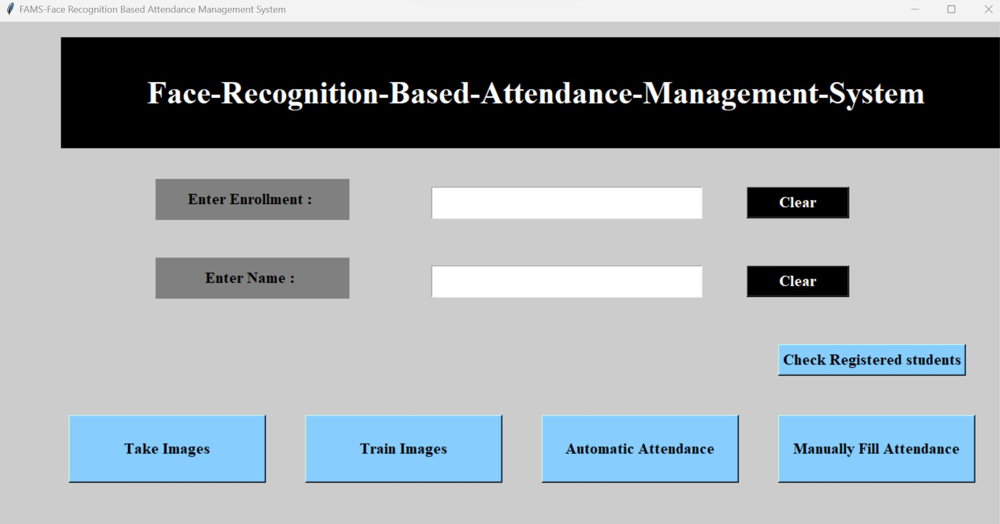
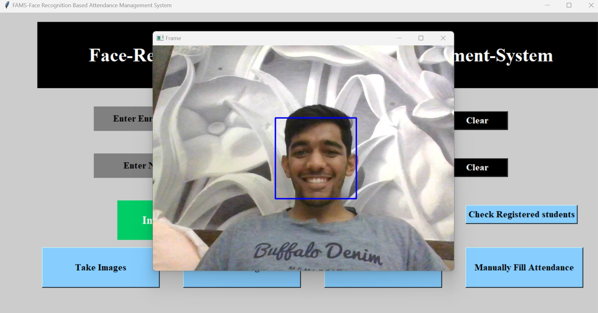
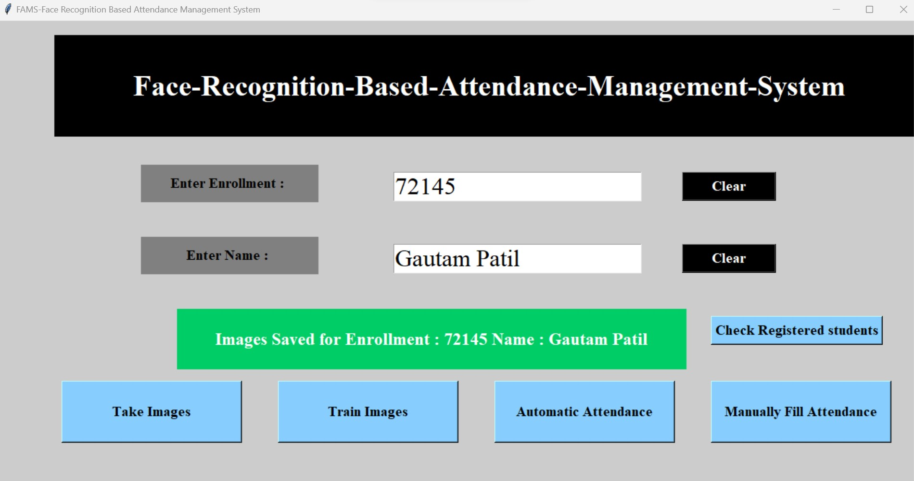

# Facial Recognition Attendance System

About:
=======
A Python-based attendance system incorporating facial recognition developed by utilizing tkinter, pandas, OpenCV, and Pillow libraries, enabling efficient and automated tracking of individuals' presence.

### Code Requirements

1.  OpenCv: https://opencv.org
2.  Tkinter: https://docs.python.org/3/library/tkinter.html
3.  PIL: https://pypi.org/project/Pillow/
4.  Pandas: https://pandas.pydata.org

### Steps to run the file:

Step 1: Download the zip file of the repository and extract all files/folders.

Step 2: Create a `TrainingImage` folder in the project.

Step 3: Open a `AMS_Run.py` and change the all paths with your system path.

Step 4: Run `AMS_Run.py`.

### Project Structure

- After running the code you need to give your facial data to the system hence enter your ID and name in box than click on `Take Images` button.
- It will collect 200 images of your face, and save the images in `TrainingImage` folder
- After that we need to train a model(for train a model click on `Train Image` button.
- It will take 5-10 minutes for training(for 10 entries).
- After training click on `Automatic Attendance`, it can fill attendance by your face using our trained model (model will be saved in `TrainingImageLabel` )
- It will create `.csv` file of attendance according to time & subject.
- You can store the data in database (install wampserver) and change the DB name according to your in `AMS_Run.py`.
- 'Manually Fill Attendance' Button in UI is to fill the attendance manually(without facce recognition), it also creates a `.csv` and store in a database.

## Screenshots

### Basic UI

### When it Recognises the Face

### Entry entered

